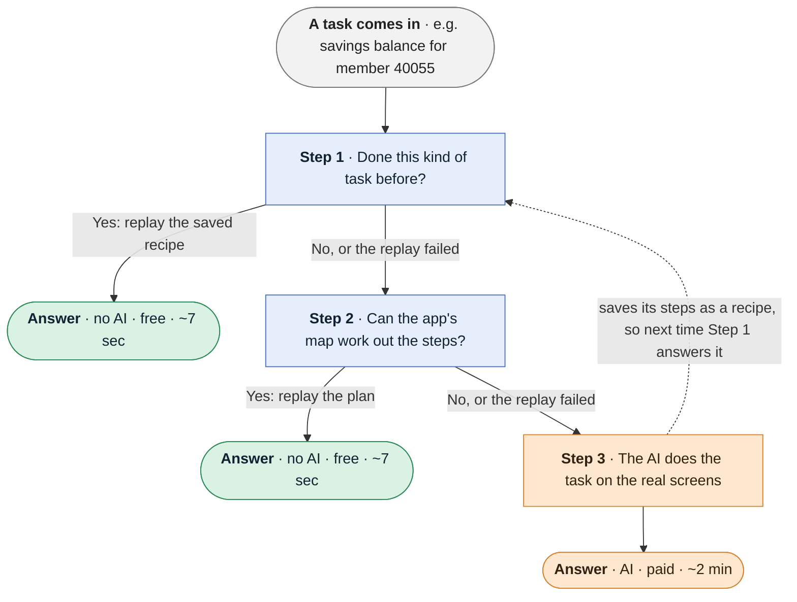

# Understudy

Automation for back-office banking software that has no API, the kind you can
only drive through the screens.

**The problem.** An AI agent can click through these screens, but it is slow
(about 2 minutes a task), costs money every time, and can make a different
mistake on each run.

**The idea.** The AI figures a task out once, and plain code repeats it: fast,
free, and the same way every time. The AI stays on call for new tasks and for
anything the code isn't sure about.



- **The map** is made once per app: the AI walks through it and records every
  screen, field and table, and what each error message means.
- **A recipe** is made once per task: the steps the AI took, with inputs (a
  member number) and outputs (a balance).
- **When unsure, it stops** and hands the task on instead of guessing.

## Results

100 tasks at eight difficulty levels, plus 74 tasks the system had never seen.
Every answer is checked by code against the app's own data, not by an AI.

| | tasks answered | model calls | cost | per task |
|---|---|---|---|---|
| AI every time | 85 / 100 | 3,612 | $33.59 | ~2 min |
| **no AI**, recipes and map | **52 / 100** | **0** | **$0.00** | ~7 sec |
| **no AI**, 74 unseen tasks | **57 / 74** | **0** | **$0.00** | ~7 sec |

**The no-AI path never gave a wrong answer in 174 tasks.** Each task runs in a
real headless Chrome browser against the live app.

## Why it works

| | AI agent every time | **Understudy** |
|---|---|---|
| Speed | ~2 min a task | ~7 sec a task |
| Cost per run | model calls every time | none after the first run |
| Same steps every run | no | yes |
| New task nobody set up | yes | often, from the map (45 of 57 unseen tasks) |
| Error messages | re-guessed each time | understood once per app |
| When unsure | may guess | stops and hands over |

1. **These apps change slowly**, so steps that worked once keep working.
2. **Controls are found by what is on screen**, e.g. "the box after *Member
   No*", and each one was tested on the real page when saved.
3. **Every step is checked**, and the answer is only returned after a final
   success check.
4. **Each error message is classified once per app** (answer, wrong input, wait
   and retry, or stop) instead of an AI guessing each time.
5. **Every step may say "not sure", none may guess.** The worst case costs the
   same as using the AI every time.

Design write-up: [REPORT.md](REPORT.md).

---

## Setting up

Python 3.11+.

```bash
git clone <this repo> && cd understudy
python3 -m venv .venv
.venv/bin/pip install -r requirements.txt
.venv/bin/playwright install chromium
```

An Anthropic API key is needed only for discovery and mapping, never for replay.
The Claude Agent SDK reads `ANTHROPIC_API_KEY`, or uses an existing Claude Code
login.

```bash
export ANTHROPIC_API_KEY=sk-ant-...      # not needed for replay
```

**The target app.** MERIDIAN CORE 4.2 is a small legacy-style banking app written
for this project: frames, nested tables, unlabelled inputs, image buttons, and
switchable problems like a locked record, a notice, and session expiry.

```bash
.venv/bin/python targets/meridian/app.py 8090
```

Sign-on is `tlr01` / `vault`. Members `40021`, `40055`, `40204` are open; `40113`
is restricted; anything else is not on file.

## Demo: discover, then replay

```bash
# 1. The AI works out a new task and saves it as a recipe (needs the API key).
PYTHONPATH=. .venv/bin/python cli.py discover \
    "Look up member {member_no} and report the savings balance" \
    --id demo.savings --base-url http://localhost:8090 \
    --param member_no=40021 --output savings \
    --credential uid=tlr01 --credential pwd=vault

# 2. Replay it for a different member. No AI involved.
.venv/bin/python cli.py replay capabilities/demo.savings.json --param member_no=40204 \
    --credential uid=tlr01 --credential pwd=vault
```

## Running without an API key

```bash
# What an agent can call, then call one
.venv/bin/python cli.py catalog
.venv/bin/python cli.py invoke meridian.members.read_balances --arg member_no=40055

# The no-AI path on the 100 tasks (~3 min) and the 74 unseen tasks (~90 sec)
PYTHONPATH=. .venv/bin/python tools/arms.py --set trained --arms D --workers 4
PYTHONPATH=. .venv/bin/python tools/arms.py --set holdout --arms D --workers 4

# Check every expected answer for the unseen tasks is really on screen
PYTHONPATH=. .venv/bin/python tools/check_holdout.py

# Tests (104, needs the app running on 8090)
.venv/bin/python -m pytest tests -q
```

## The benchmark

The same 100 tasks, run four ways ("arms" in the code) to show what each part adds:

| | Uses | Result |
|---|---|---|
| **A** | the AI on every task | 85/100, $33.59 |
| **B** | the AI on every task, plus the map | 87/100, $29.28 |
| **C** | saved recipes first, the AI otherwise; starts empty and learns as it goes | 84/100, $25.84 |
| **D** | no AI: only recipes from C plus plans from the map | 52/100, $0, none wrong |

The map makes the AI cheaper (B vs A). Learning as it goes saves 23% at the same
accuracy (C vs A). D is the free path alone.

```bash
PYTHONPATH=. .venv/bin/python tools/arms.py --arms A,B,C,D --workers 4   # ~$74, ~3 hours
PYTHONPATH=. .venv/bin/python tools/arms.py --pilot 12 --arms A,B,C      # ~$9, ~20 min
```

Results: `evidence/arms.json` (100 tasks), `evidence/arms-holdout.json` (74 unseen).

## What is where

```
understudy/
  solve.py        the three steps: recipe, then map, then AI
  sitemap.py      the map
  cache.py        saved recipes, and which are safe to keep
  plan.py         builds a recipe from the map, no AI
  artifact/       the recipe (capability) schema
  replay/         runs a recipe with no AI, handles errors
  discovery/      the AI learning a task, and mapping the app
  surface/        the browser: accessibility tree, finding controls
  policy.py       allowlist and risky-action rules
  handoff.py      handing the live session to a person and back
  catalog.py      what an AI agent calls

tools/            the benchmark, its tasks, and the mapping scripts
evidence/demo/    a discovery, replays (success, error, refused) and an escalation
```
