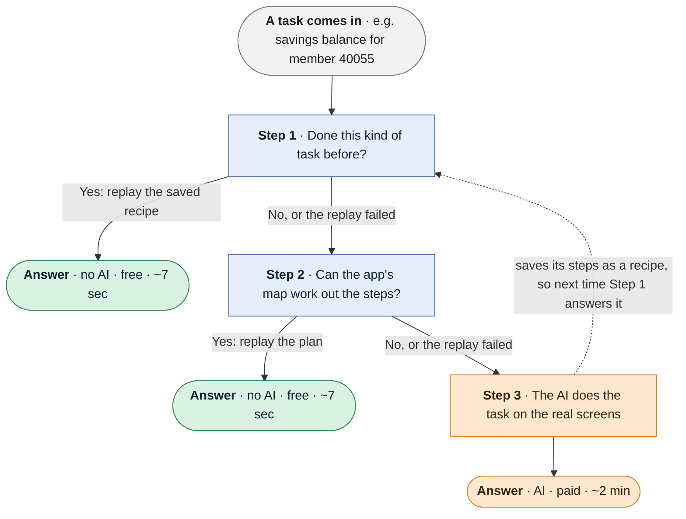

# Understudy — design write-up

An LLM works out a task on a legacy banking app once. The steps become a typed
capability an AI agent can call, and from then on the task replays with no model.
The question worth measuring is how much real work that covers, and what it
saves. Tested on 100 tasks across eight difficulty tiers, then 74 unseen ones:

| | tasks answered | model calls | cost |
|---|---|---|---|
| a model every time | 85 / 100 | 3,612 | $33.59 |
| the model, given the map | 87 / 100 | 3,104 | $29.28 |
| recipes first, model as fallback | 84 / 100 | 2,799 | $25.84 |
| **no model at all** | **52 / 100** | **0** | **$0.00** |
| **no model, 74 unseen tasks** | **57 / 74** | **0** | **$0.00** |

**Across all 174 tasks the no-model path never returned a wrong answer.** A cheap
automation that is sometimes wrong about a balance is worse than none, so
anything the system cannot be sure of, it refuses.

---

## 1. Architecture

Two things are learned once and reused:

- **The map** (learned once per *app*). One LLM survey records every screen, its
  controls, labelled values and tables, where each control leads, and what each
  app message means. Nothing goes in unless it resolved on the real page.
- **Recipes** (learned once per *task*). The first successful run of a task is
  saved as a typed capability (§2), keyed by the goal with its inputs masked, so
  "member 40021's balance" and "member 40055's balance" share one recipe.

Every task goes through three steps. The first two cost nothing. The AI is only
used when both of them can't answer:



A recipe is only saved if it will also work for other inputs (§2). This is
`solve()` in `understudy/solve.py`.

**The rule: each step may refuse, none may guess.** A refusal just passes the task
down, so accuracy is set by the model at the bottom and the free steps only decide
how much of it was free. That is why cost falls 23% while accuracy holds. With no
model allowed, step 3 does not run and the task is handed back with the reason.

**Key decisions**

- **Accessibility tree, not DOM selectors.** Controls are found by role and name,
  by "the control after this text", by position, or by CSS as a last resort. On
  this app "the control after text X" is the main strategy, because inputs have
  no accessible name. The cost: visible text is what differs most between tenants
  (§4).
- **The map matters more than recipes.** Of the 57 unseen tasks answered free,
  **45 came from the map** and 12 from recipes. Recipes can only repeat; the map
  can do tasks nobody showed it.
- **A simple rule-based planner.** Building a recipe from the map picks the screen
  holding the answer, the shortest route there, and which input goes in which
  field. If any of that is ambiguous it refuses. Measured: 45 unseen tasks, none
  wrong.

---

## 2. Artifact schema

A capability is a contract: what it needs, what it returns, whether it is safe.

```python
Capability:
  id, version, goal, app{product, base_url}
  params     : [Param{name, type, example, required}]
  steps      : [Step{intent, action, target: Locator, value, risk,
                     requires_human, postcondition, timeout_ms}]
  outputs    : [Output{name, type, locator, at_step, pattern}]
  success    : Check
  recoveries : [Recovery{code, detect, action, target, seconds, why}]
  approval, planned_from_map
```

- **Every locator says why it was chosen and whether it was verified** on the real
  page, so a reviewer can audit it and a maintainer can find the unverified ones.
- **Secrets are referenced, never stored.** A password step carries
  `from_secret: "pwd"`; the value is supplied at replay.
- **Outputs can carry a pattern**, e.g. money-shaped for a balance, so "a value
  came back" becomes "the right kind of value came back".
- **Steps carry risk.** `risk: irreversible` is what the policy gate reads to
  refuse an unattended transfer (§6).
- **Recoveries live on the capability**, inherited from the map, so every recipe
  handles an app's interruptions the same way.

**Why recipes are checked before saving.** A read anchored to a label works for
every member; a read anchored to the data works only for the one it was recorded
on:

```
after_text "Savings Bal."                          ← a label. Works for everyone.
role=row   "Date Type Amount 11/09 DEPOSIT 128.00" ← one member's data. Wrong for others.
after_text "Amount"                                ← a column header: whichever row is first.
```

In one run, two such recipes returned confident wrong answers (the newest item
for "oldest item"). So `cache.fit` only saves a recipe whose reads are anchored
to something the map recorded as naming a value; otherwise it swaps in the map's
read or declines to save.

---

## 3. Determinism & error handling

Replay runs every step the same way, with no model:

```
 each step
   wait for the page to settle
   policy allows it?            ── no ─────────┐
   find the control             ── not found ──┤
   act, then check it landed    ── no ─────────┤
                                               ▼
                         a known recovery matches the page?
                           yes ─▶ apply it and retry the step (a few times at most)
                           no  ─▶ stop

 at the end
   a known business outcome on screen?   ─▶ return it, e.g. "no such member"
   success check passes, outputs valid?  ─▶ complete, with outputs
   otherwise                             ─▶ failure: step, expected, observed, screenshot
```

Determinism comes from locators verified at record time, a check after every
step, a final success check, and waiting for the page to settle instead of a
fixed delay. (Without that wait, the same page returned 110 or 180 lines
depending on timing, and every action looked successful.)

The result is `complete`, `incomplete_action` or `unreachable`, plus a subclass
naming the cause (`control_not_found`, `policy_refused`, a business outcome's
code). **The map decides what each app message means, which maps onto the
brief's three categories:**

| app says | meaning in the map | brief's category | replay does |
|---|---|---|---|
| `NO MEMBER ON FILE` | answer | business outcome | returns it as the result |
| `MEMBER NO. MUST BE NUMERIC` | caller_error | business outcome | stops, says the input was wrong |
| maintenance notice | interruption | recoverable | dismisses it with the recorded control |
| `RECORD IN USE BY ANOTHER TERMINAL` | busy | recoverable | waits and retries |
| `SESSION EXPIRED` | session | recoverable | signs on again; won't restart a flow that changes data |
| `NOT AUTHORISED` | permission | hard failure | stops; a person decides. Never retried |

Meanings are decided once per app, in the map, because a model asked twice about
identical screens gave two different answers. A failure carries the step, what
was expected, what was seen, and a screenshot
(`evidence/demo/replay-error-state/`).

**Answers that are not fields.** "The third posted item" is safe to read by
position. "The oldest item" is refused, because the map does not know how a table
is sorted, and guessing returned `14/09` for `02/09`. Counts are read from the
app's own line (`Items shown: 3 of 3`) rather than by counting rows.

**Limit.** The survey ran on a quiet copy of the app, so the only recovery the map
actually learned is session expiry. The others are built and tested but the map
has no example of them yet. **UI drift** shows up as `control_not_found` naming
the locator that broke, never as a wrong answer.

---

## 4. Heterogeneity & multi-tenant

The brief asks two things here. Will this work on apps that aren't modern
websites? And can hundreds of banks running the same product share one recipe,
instead of each recording their own?

**Other kinds of apps.** The system never reads HTML. It works from the
accessibility tree, the list of buttons, fields and labels that screen readers
use, and desktop apps expose the same kind of list through the operating system.
Only the bottom layer, which looks at the screen and clicks, is tied to the
browser:

```
   recipes · map · replay · safety rules     ← the same for every kind of app
  ────────────────────────────────────────
   Surface: observe · click · type · read    ← the only part that changes
  ────────────────────────────────────────
   browser (built)      │   desktop app (not built)
```

A desktop app needs a new `Surface`, and existing recipes carry over, except
steps that used a CSS selector (the last-resort locator), which only exists in a
browser. The target app is already the hard web case: frames, tables nested four
deep, inputs with no labels, image buttons.

**Many banks on the same product.** A recipe is tied to the *product*, not to one
bank's URL, and each bank's URL is swapped in at replay. This came from a bug:
when recipes were tied to a URL, the safety rules blocked every replay on a second
copy of the app at its first step, and the no-model score was 23/100. Tying
recipes to the product raised it to 43.

Where one bank's copy differs (other wording, a newer version), a per-bank
**overlay** stores only the difference: its URL, and replacements for the few
locators that don't match. The shared recipe is untouched. If a locator doesn't
match and there's no overlay for it, replay stops with `control_not_found`
instead of returning a wrong answer.

**Built vs. shown.** The `Overlay` type is built and tested, and
`cli.py replay --tenant name=url` applies one. No second, differently branded
copy of the app was set up, so replacing locators for another bank has not been
demonstrated.

---

## 5. Escalation & handoff

**When it stops.** Discovery stops when it runs out of model responses, passes its
time limit, makes four attempts in a row that change nothing, or keeps returning
to the same screens. Those stops end the run with the reason logged. A live
handoff happens when the model calls `escalate`, which it is told to do when
stuck or when a step needs a person, such as an irreversible transfer.

**Who holds the session.** Control is a lease with exactly one holder. Discovery
checks it before every click, type and select, so the agent cannot act while a
person holds the session:

```
   agent ──(escalate: context + screenshot)──▶ none ──(operator takes it)──▶ human
     ▲                                                                         │
     └──────────────────(resume: re-observe the page, carry on)────────────────┤
                                                                               │
                                                  abort or timeout ──▶ run ends
```

- **Routing.** The request carries the goal, step, live URL, screenshot, operator
  address and the reason in plain words
  (`evidence/demo/escalation-asked-for-a-human/`).
- **Same live session.** The browser stays open on the same page, cookies and
  half-filled form intact. Only the lease changes hands. It lives in
  `control.json` so the operator, a separate process, can read it.
- **Recording the human.** A recorder captures what the person does.
- **Handing back.** The runner re-reads the page and continues from there rather
  than restarting.

**Gap.** The evidence run shows the lease moving agent → none → human → back, but
the return is the escalation timeout expiring, not a person acting. A full round
trip with a real person has not been demonstrated.

---

## 6. Safety

- **Allowlist enforced on every action.** Allowed origins, routes and action types
  are checked before each action runs. That check is what caught the URL-keying
  bug in §4.
- **Irreversible actions are a class.** Steps are classified when recorded.
  Unattended, an irreversible step is refused and escalated. Attended, it may run
  because a person is accountable, and the result records that.
- **Secrets never become data.** Credentials are referenced by name and supplied
  at run time. Session tokens are scrubbed from observations before anything is
  stored or hashed.

**Limits.** The allowlist works at route level, not field level: a permitted flow
can still type a wrong but permitted value. Redaction is pattern-based, so an
unusual PII format could reach a log. Attended mode trusts the caller's claim
that a person is present. A data-changing flow abandoned half-way has no undo.

---

## 7. Cuts

**Left out**

- A self-improving loop that rewrote recipes after failures. It did not improve
  results, so it was removed.
- Desktop support and a second bank's copy of the app (designed in §4, not built).

**Next**

1. Make the map survey keep going until every screen has been visited. Most
   unseen-task misses are screens the map never saw.
2. Show a real person taking over the session and handing it back (§5).
